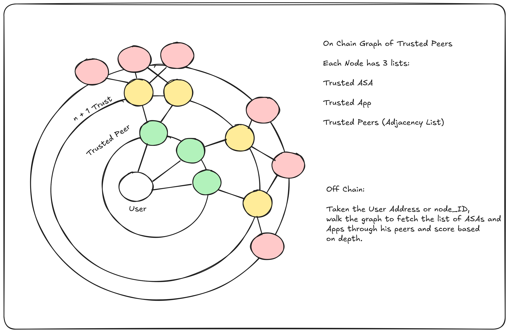

# WeTrust

## Abstract

Discoverability on chain for new applications and assets depends on centralized verification systems. While this is doesn't imply security issue it creates a significant hurdle in scaling to meet all the future newly created applications and assets.

Some other attempts to completely decentralize these systems tends to hit a hard wall when faced on how to reach consensus while scaling. Is it DAO based? Token based or Account based?

Through a social network of trust, each user can creates his own scoring system based on his trusted peers, an inner circle of other accounts that you trust regarding ASA and Applications.

The ranking of the given ASA or Application for the user is calculated by traversing the tree and checking whatever it is included in his peers inclusion lists.

## Rationale

Tha calculation for the scoring is not set at the Smart Contract level, on chain the Contract's job is to only create the graph through the nodes and edges in the adjacency list. Each Front End app either wallet or explorer can set up different weights on the edges based on their preference.

## Future Work

- Graph Explorer & Scoring

- Enhancement discussion for Merkle Tree instead of an Array

- ZK proof of relation to not expose Addresses.
